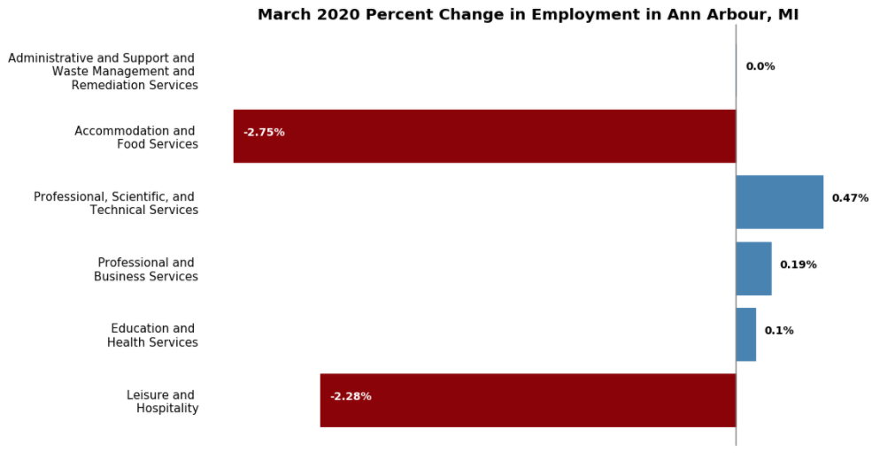

# Applied Plotting, Charting, and Data Representation in Python
I enrolled in this course to learn more about the principals of data visualization and how to use MatPlotLib in Python to create effective data visualizations. Data isn't something you throw around. It is an art form to be able to take raw data and transform it into useful information. This is one of the beauties of data though: it can be an impressive medium for communication. I love using data to tell a story, and to do that, I am learning different ways to create effective data visualizations. 

On top of learning how to use MatPlotLib's scripting layer to create data visualizations, we also looked at two texts in this course, *The Truthful Art* by Alber Cairo and *The Visual Display of Quantitative Information* by Edward Tufte, to examine some important principals to keep in mind when creating visualizations. It is so easy to fool ourselves, and as the creator of the visual, we have to make sure to stay true to the raw data and stray away fron our own biases. All of the principals discussed were applied to each visualization, and I will explain some of Cairo's ideas as it applies to my final project.

## Notebooks
1. [Visualization 1] (https://github.com/lelandroberts97/covid_19_change_in_employment/blob/master/Assignment2.ipynb)
2. [Visualization 2] (https://github.com/lelandroberts97/covid_19_change_in_employment/blob/master/Assignment3.ipynb)
3. [Final Project] (https://github.com/lelandroberts97/covid_19_change_in_employment/blob/master/Change%20in%20Employment%20March%202020.ipynb)

## Report for Final Project

### Goal
The goal of this assignment is to utilize the principals of data visualization found in "The Truthful Art" by Albert Cairo to create a truthful, functional, beautiful, and insightful data visualization. 

### Question
What industries have suffered the most job losses in March 2020 in Ann Arbour, MI, likely as a result of COVID-19? Specifically, which industries has lost the most employees relative to the amount of employees it had?

### Data
The data that I chose to use came from the Federal Reserve Economic Data (FRED). It contained the number of employees taken on a monthly bases from different industires in Ann Arbour, MI. Here are the six datasets:
- https://fred.stlouisfed.org/series/SMU26114606056000001
- https://fred.stlouisfed.org/series/SMU26114606054000001SA
- https://fred.stlouisfed.org/series/ANNA426PBSV
- https://fred.stlouisfed.org/series/ANNA426EDUH
- https://fred.stlouisfed.org/series/SMU26114607072000001SA
- https://fred.stlouisfed.org/series/ANNA426LEIH

### Visualization

### Conclusion

The accommodation and food services as well as the Leisure and hospitality industries have shown the greatest percent decrease in jobs for March 2020 in Ann Arbour, MI, with a 2.75 and 2.28 percent decrease in jobs, respectively. This makes sense as many restaurants are forced to close based on social distancing protocols, and hardly anyone is traveling.

Other industries I looked at showed either no change or a positive change. I was surprised by this at first, but after considering it, most professional services are becoming more information-based, and many people are still able to work from home in these industries.

### Albert Cairo's Principals of Data Visualization

**Truthfulness:** no change was made to the raw data. Percent change was used to normalize the data and provide a more accurate representation of the change in jobs.

**Beauty:** I chose to use colors that worked well together, and made sure the aesthetic of the image was pleasing to the eye

**Functionality:** I directly labeled the bars to increase comprehension, as well as eliminated unnecessary "chart junk" like ticks and spines

**Insightfulness:** Calculating the percent change in jobs for each industry and combining them in a simple bar chart provided a unique visual of which industries are likely being affected by COVID-19
